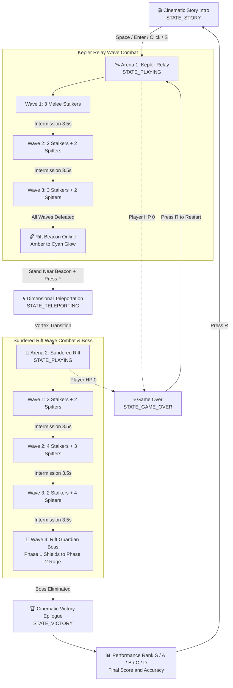

# Riftwalker: Paradox Protocol

> 🚀 **Quick Setup & Run Guide:** See **[RUN_GUIDE.md](RUN_GUIDE.md)** for a complete step-by-step beginner guide, Python installation walkthrough, 1-click launchers, and troubleshooting.
>
> 📄 **Instructor & Evaluator Project Summary:** See [docs/PROJECT_BRIEF.md](docs/PROJECT_BRIEF.md) and [docs/Riftwalker-Paradox-protocol.md](docs/Riftwalker-Paradox-protocol.md) for a concise, all-in-one technical brief designed for course evaluators and lab instructors.

**Course Context:** Computer Graphics 423 (CSE423 / CG423)

**Project Goal:** A real-time 3D PyOpenGL/GLUT sci-fi combat game demonstrating advanced computer graphics techniques (hierarchical matrix modeling, procedural geometry generation, dual-camera projections, multi-source dynamic lighting, particle systems, 3D raycasting, and Chrono Slow time dilation).

---

## 🎮 Overview

In **Riftwalker: Paradox Protocol**, an astronaut equipped with an experimental **Rift-Chrono Suit** fights otherworldly *Crystalline Void* invaders across two distinct tactical arenas:

1. **Kepler Relay (Arena 1):** High-tech industrial relay outpost with a metallic floor grid, perimeter security walls, server pillars, crates, and covered combat walkways.
2. **Sundered Rift (Arena 2):** Floating cosmic asteroid void with an obsidian ground plateau, neon purple anomaly grid, and glowing crystal spires (open boss arena).

### Signature Mechanics

* **Tactical Rift Beacon Teleportation (REQUIRED):** Teleport between arenas via linked interactive Rift Beacons (`Arena 1 Beacon` $\leftrightarrow$ `Arena 2 Beacon`) featuring animated spinning torus rings, a cyan vortex particle swirl, and a screen flash. Teleportation can be used tactically during combat to reposition or retreat.
* **Chrono Slow (Time Dilation):** Signature time-manipulation ability. The charge bar fills from 0% to **100%** via combat kills and collectible pickups. Pressing **`Q`** consumes the full 100% charge, resets the meter to **0%**, and triggers **5.0 seconds of 30% time dilation** (`game_dt = real_dt * 0.30`). Enemies and plasma projectiles slow down to 30% speed while the player moves, aims, and fires at 100% normal speed. Enhanced by a cool-blue screen overlay and radial Chrono ripple particles.
* **Collectible Rift Energy Pickups:** Floating, spinning cyan/magenta crystal octahedrons with rotating halo rings placed across both arenas. Collecting one awards **+25% Chrono Charge**, +150 score, and spawns sparkling particle bursts (15-second respawn timer).
* **Dual Camera & 1P Weapon Viewmodel:** Pressing **`V`** toggles between First-Person (FPS) and Third-Person (TPS) while preserving pitch and yaw. In 1P mode, renders a dedicated 3D blaster rifle viewmodel in the bottom-left foreground with firing recoil and cyan energy rails. In 3P mode, renders the full articulated astronaut rig with walking limb swings.
* **Procedural Crystalline Void Enemies:** Faceted obsidian shard carapaces, glowing cyan/purple rift cores, and rotating orbital shard rings:
  * **Rift Stalker (Melee):** Fast quadrupedal shadow-hound with swinging scythe blades.
  * **Rift Spitter (Ranged):** Floating crystal prism with dual counter-rotating orbital shard rings launching plasma bolts.
  * **Rift Guardian (Boss):** Multi-phase final boss with 4 rotating orbital shield obelisks (rapid spinning and radial shockwaves in Phase 2) and a dedicated top-center Boss Health Bar.
* **Blink Teleport (Stretch Feature):** Optional short-range evasive combat dash (`E` / `Shift`).

---

## 🔄 Complete Game Flow & Mission Progression

The game follows a structured narrative and wave-progression combat loop with state-machine coordination across both tactical arenas:



### 📋 Mission Progression Breakdown

| Phase | Game State | Environment / Level | Wave Composition | Beacon Status & Objectives |
|---|---|---|---|---|
| **0. Mission Briefing** | `STATE_STORY` | Terminal Screen | N/A | Typewriter intro establishing Rift-Chrono lore. Advance with `Enter`/`Space`/`Click` or skip with `S`. |
| **1. Kepler Relay Outpost** | `STATE_PLAYING` | **Arena 1**<br>Industrial Metallic Outpost | **Wave 1:** 3 Melee Stalkers<br>**Wave 2:** 2 Stalkers + 2 Spitters<br>**Wave 3:** 3 Stalkers + 2 Spitters | 🔒 **Beacon Locked (Amber Rings)** during combat.<br>Defeating all 3 waves triggers `"ARENA 1 CLEARED — RIFT BEACON ONLINE"`. |
| **2. Dimensional Warp** | `STATE_TELEPORTING` | Inter-dimensional Rift | N/A | Step into central beacon ($R \le 3.5\text{m}$) and press **`F`**. Plays cyan vortex particle swirl, screen flash, and repositions player into Arena 2. |
| **3. Sundered Rift Void** | `STATE_PLAYING` | **Arena 2**<br>Floating Obsidian Asteroid | **Wave 1:** 3 Stalkers + 2 Spitters<br>**Wave 2:** 4 Stalkers + 3 Spitters<br>**Wave 3:** 2 Stalkers + 4 Spitters | ⚡ Collect glowing Rift Energy Pickups (+25% Chrono charge). Top HUD banner tracks incoming threat waves. |
| **4. Final Boss Encounter** | `STATE_PLAYING` | **Arena 2**<br>Deep Asteroid Core | **Wave 4 (Boss):**<br>• **Rift Guardian Boss**<br>• 2 Elite Stalker guards | **Phase 1 (100%–51% HP):** 4 orbiting shield obelisks block lasers.<br>**Phase 2 ($\le$ 50% HP):** Destabilized crimson core, rapid spinning, radial shockwaves. |
| **5. Victory Epilogue** | `STATE_VICTORY` | 3-Panel Cinematic Story | N/A | 3 cinematic narrative panels unravel the paradox, culminating in a final mission score summary & performance grade (**Rank S, A, B, C, D**). Press **`R`** to replay. |
| **Failure State** | `STATE_GAME_OVER` | Any Arena | N/A | Triggered on player death ($\text{HP} \le 0$). Displays red Game Over overlay with instant restart on **`R`**. |

---

## 👥 Team Work Breakdown (The 12 Major Features)

| Module | Member Responsibility | Core Deliverables (3 Major Features per Member) |
|---|---|---|
| **M1** | **Player & Camera Systems** | **1.** Procedural Hierarchical Astronaut Rig (`glPushMatrix`/`glPopMatrix`, suit, visor, thruster pack, articulated walking limbs)<br>**2.** Dual Camera System (`V` toggle for 1P FPS & 3P orbital TPS)<br>**3.** Player Movement & 1P Blaster 3D Viewmodel (WASD kinematics, velocity damping, foreground 3D rifle viewmodel with firing recoil) |
| **M2** | **Enemies & Combat Systems** | **1.** Procedural Crystalline Void Alien Generator (Obsidian carapaces, glowing rift cores, articulated scythes & rotating shard rings)<br>**2.** Enemy AI & Hitscan Combat (Melee Stalker pursuit, Ranged Spitter kiting, 3D raycast laser fire & projectile collisions)<br>**3.** Rift Guardian Boss Encounter (Pulsating nexus core, 4 rotating orbital shield obelisks, Phase 1 vs Phase 2 rapid spinning) |
| **M3** | **World, Arenas & Teleportation** | **1.** Kepler Relay Arena (Industrial space station, metallic floor grid, security walls, pillars, crates, tighter covered combat)<br>**2.** Sundered Rift Arena (Floating obsidian asteroid void, neon purple anomaly grid, crystal spires, open boss battleground)<br>**3.** Tactical Rift Beacon Teleportation & Pickups (Linked interactive beacons with vortex transitions + glowing collectible Rift Energy crystals) |
| **M4** | **Rendering, Chrono & HUD Integration** | **1.** Multi-Source Dynamic Lighting (`GL_LIGHT0` directional sun + `GL_LIGHT1` dynamic beacon/projectile point light attenuation)<br>**2.** Procedural Particle & VFX System (Teleport vortex, hit sparks, collectible sparkle bursts, alien death shatter, Chrono ripples)<br>**3.** Chrono Slow Dilation & 2D HUD Loop (100% gate, 0% reset, 5s 30% time dilation, cool-blue screen overlay, health/chrono/boss bars, score & crosshair) |

---

## 🏗️ Architecture & Directory Structure

The project follows a clean, modular architecture dividing gameplay, rendering, mathematics, physics, and assets across isolated subsystems. Detailed design specifications are documented in [docs/architecture.md](docs/architecture.md).

```text
CSE423_LAB_Project/
├── run_game.bat                          # ⚡ 1-Click Windows Launcher (auto-installs & launches)
├── run_game.ps1                          # ⚡ PowerShell Launcher
├── run_game.sh                           # ⚡ macOS / Linux Launcher
├── check_requirements.py                 # Dependency verification forwarder
├── requirements.txt                      # Python runtime dependencies
├── RUN_GUIDE.md                          # 📖 Step-by-step setup, Python installation & launch guide
├── README.md                             # Primary project documentation & workflow guide
├── PROJECT_SPEC.md                       # Comprehensive single source of truth specifications
├── AGENTS.md                             # Mandatory AI directives & Git safety rules
├── GEMINI.md                             # AI workspace directives
│
├── assets/textures/                      # PNG textures & visual assets
│   ├── background/                       # Space skybox textures
│   ├── characters/                       # Suit, visor, & alien textures
│   ├── environment/                      # Floor panels, metal walls, rock textures
│   ├── rift/                             # Teleportation beacon runes & energy textures
│   └── weapons/                          # Plasma rifle & blaster textures
│
├── docs/                                 # Complete documentation & course guides
│   ├── PROJECT_BRIEF.md                  # High-level technical summary for instructors/evaluators
│   ├── Riftwalker-Paradox-protocol.md    # Course lab overview document
│   ├── architecture.md                   # Complete architectural specification & diagrams
│   ├── graphics_techniques.md            # Comprehensive graphics pipeline breakdown
│   ├── controls.md                       # Complete input bindings & control schemes
│   ├── team_tasks.md                     # Module ownership & feature delivery matrix
│   ├── implementation_notes.md           # Subsystem engineering notes
│   ├── integration_audit.md              # System integration audit
│   ├── TODO.md                           # Team task tracking
│   ├── CHANGELOG.md                      # Version release notes
│   └── specs/                            # Historical & archival specification documents
│       └── Riftwalker_Paradox_Protocol_Project_Spec_v2.md
│
├── scripts/                              # Automated setup, installer & diagnostic scripts
│   ├── check_requirements.py             # Dependency validation & automatic pip installer
│   ├── setup_environment.py              # Setup runner wrapper
│   └── install_requirements.bat          # Windows batch installer with unit test run
│
├── scenes/                               # Scene layout definitions
│   ├── arena_01_kepler_relay/            # Arena 1 spawn & obstacle configurations
│   └── arena_02_sundered_rift/           # Arena 2 spawn & crystal layout configurations
│
├── screenshots/                          # Gameplay captures & evaluation screenshots
│
├── src/                                  # Core application source code
│   ├── main.py                           # Master application entry point & GLUT loop
│   │
│   ├── shared/                           # Central shared utilities & physics
│   │   ├── collision.py                  # Geometric tests, obstacles (Cylinders, AABBs), & sliding physics
│   │   ├── constants.py                  # Physics, gameplay, speed, camera, & key constants
│   │   ├── game_time.py                  # Delta time regulation & Chrono Slow time scaling
│   │   ├── input_manager.py              # Centralized keyboard & mouse state tracking
│   │   ├── math3d.py                     # Vector3 math, transformations, & ray intersections
│   │   └── texture_loader.py             # Texture loading, caching, & procedural pattern generators
│   │
│   ├── M1_player_camera/                 # [M1] Player Character & View Systems
│   │   ├── astronaut_rig.py              # Procedural hierarchical astronaut rig with walking limbs
│   │   ├── blink_teleport.py             # Short-range evasive combat dash
│   │   ├── first_person_camera.py        # 1st-person FPS camera with look-at transformations
│   │   ├── player.py                     # Player coordinator, health, & camera binding
│   │   ├── player_movement.py            # Kinematics, WASD movement, & velocity calculations
│   │   ├── player_weapon.py              # 1P weapon 3D viewmodel with recoil & muzzle flare
│   │   └── third_person_camera.py        # 3rd-person orbital follow camera
│   │
│   ├── M2_enemies_combat/                # [M2] Alien AI & Combat Systems
│   │   ├── alien_generator.py            # Procedural crystalline void enemy geometry builder
│   │   ├── collision.py                  # Combat collision bridge & boundary helpers
│   │   ├── enemy_base.py                 # Abstract base enemy class with HP & draw transformations
│   │   ├── melee_rift_stalker.py         # Quadrupedal melee hunter AI with scythe blades
│   │   ├── ranged_rift_spitter.py        # Hovering plasma spitter AI with rotating shard rings
│   │   ├── raycast.py                    # Authoritative crosshair raycasting for hitscan lasers
│   │   ├── rift_guardian_boss.py         # Multi-phase boss with orbiting shield obelisks
│   │   └── weapon_system.py              # Enemy projectile manager, active projectiles & pool
│   │
│   ├── M3_world_teleport/                # [M3] Arenas, Environment & Teleportation
│   │   ├── arena_01_kepler_relay.py      # Arena 1: Metallic space outpost with pillars & crates
│   │   ├── arena_02_sundered_rift.py     # Arena 2: Floating asteroid void with crystal spires
│   │   ├── arena_base.py                 # Abstract arena container with obstacle registry
│   │   ├── environment_generator.py      # Modular 3D props (crates, pillars, crystal spires)
│   │   ├── gravity_zone.py               # Predefined gravity & jump-pad zones
│   │   ├── rift_beacon.py                # Interactive teleportation beacon pillar with rotating rings
│   │   ├── rift_energy_pickup.py         # Collectible floating crystal restoring Chrono Charge
│   │   └── world.py                      # World manager coordinating active arenas & transitions
│   │
│   └── M4_rendering_gameplay/            # [M4] Graphics Pipeline, Effects, HUD & Game State
│       ├── chrono_slow.py                # Chrono Slow manager (100% gate, 0% reset, 5s duration)
│       ├── crosshair.py                  # Interactive 2D crosshair with hitmarker animations
│       ├── effects.py                    # Post-processing screen flash & Chrono distortion tint
│       ├── game_state.py                 # Global state machine (STORY, PLAYING, TELEPORT, GAMEOVER, VICTORY)
│       ├── hud.py                        # 2D Orthographic HUD (Health, Chrono, Boss bar, Score)
│       ├── level_manager.py              # Wave progression & enemy spawn tables
│       ├── lighting.py                   # Multi-source lighting (GL_LIGHT0 sun, GL_LIGHT1 point lights)
│       ├── materials.py                  # Specular, diffuse, ambient, & texture binding materials
│       ├── particles.py                  # GPU-style particle emitter (vortex, sparks, bursts, ripples)
│       ├── primitives.py                 # Procedural textured primitives (cubes, cylinders, spheres, etc.)
│       ├── renderer.py                   # Master render orchestrator coordinating all passes
│       ├── scoring.py                    # Score evaluation, combo multipliers, & kill tracking
│       └── story_intro.py                # Terminal story intro with typewriter text & audio waveform
│
└── tests/                                # Automated Unit Test Suite
    ├── test_aiming_system.py             # Precision raycasting & muzzle alignment tests
    ├── test_camera_input.py              # Camera yaw/pitch clamping & view switching tests
    ├── test_collision.py                 # Sphere, AABB, cylinder sliding, & arena collision tests
    ├── test_gameplay_logic.py            # Scoring, state transitions, & chrono charge tests
    ├── test_math3d.py                    # Vector3 math, transformations, & ray tests
    ├── test_story_intro.py               # Story mode state machine & typing tests
    └── test_texture_loader.py            # Texture loading & procedural generator fallback tests
```

---

## 🚀 Getting Started

### ⚡ One-Click Automated Setup & Launch (Windows / Cross-Platform)

For the easiest setup, simply use the automated setup launcher:

* **Windows Users (1-Click):** Double-click **[`run_game.bat`](file:///Users/dhrubojyoti/Projects/CSE423_LAB_Project/run_game.bat)** (or **[`run_game.ps1`](file:///Users/dhrubojyoti/Projects/CSE423_LAB_Project/run_game.ps1)** in PowerShell).
  * Automatically checks Python version & pip.
  * Automatically detects missing packages and installs them via `pip`.
  * Automatically configures Windows FreeGLUT DLLs (`OpenGL/DLLS`).
  * Pre-generates all 16 procedural texture PNG assets.
  * Launches the game immediately!
* **Cross-Platform / Command Line:**
  ```bash
  # Check dependencies, auto-install missing packages, and launch game
  python check_requirements.py --run

  # Or only check status:
  python check_requirements.py --check

  # Or install dependencies and run unit test suite:
  python check_requirements.py --install --test
  ```
* **macOS / Linux:**
  ```bash
  ./run_game.sh
  ```

---

### 📦 Manual Installation & Setup

#### Prerequisites
* Python 3.8+
* PyOpenGL & PyOpenGL_accelerate
* NumPy
* Pillow (for procedural PNG texture generation)
* pytest (for testing)

#### Manual Installation:
```bash
pip install -r requirements.txt
```

#### Running Automated Unit Tests:
All 35+ automated unit tests across test suites verify game math, physics, collision detection, Chrono Slow resource management, texture loading, story sequence, scoring, and state machines:
```bash
python3 -m unittest discover -s tests
```

#### Running the Game:
```bash
python3 src/main.py
```

---

## ⌨️ Controls

| Input | Action |
|---|---|
| **`W`, `A`, `S`, `D`** | Move (Forward, Strafe Left, Backward, Strafe Right) |
| **Mouse Movement** | Look / Aim (Pitch and Yaw Precision Aim) |
| **Arrow Keys (`←`, `→`, `↑`, `↓`)** | Continuous Smooth Camera Turn & Pitch |
| **`Left Click` / `Space`** | Fire Hitscan Laser Rifle (with Muzzle Flare & Recoil) |
| **`V` / `C`** | Toggle 1st-Person (FPS Viewmodel) / 3rd-Person (Astronaut Rig) |
| **`Q`** | Activate Chrono Slow (Requires 100% Charge, lasts 5.0s) |
| **`F`** | Interact / Teleport near Linked Rift Beacon Platform |
| **`E` / `Shift`** | Blink Dash (Evasive Teleport) |
| **`F11`** | Toggle Fullscreen Mode (Fit Display) |
| **`R`** | Restart Mission (Game Over / Victory screen) |
| **`Esc`** | Exit Game |


---

## 🛡️ Git Workflow & Main Branch Protection Policy

To protect the stability of the master build and prevent accidental overwrites or merge conflicts across the 4 teammates, **direct pushes to the `main` branch are strictly prohibited**.

All development by team members and AI assistants must follow the **Feature Branch & Pull Request (PR)** model.

### 📌 Core Rules for Everyone (Members & AI Assistants)

1. **Never commit or push directly to `main`**:
   * Always create a new descriptive branch for each feature or bugfix (e.g., `feature/m1-astronaut-rig`, `feature/m2-crystalline-aliens`, `feature/m3-energy-pickups`, `feature/m4-chrono-vfx`).
2. **One Feature, One Branch**:
   * Keep branch changes focused strictly on your module's assigned tasks.
3. **Pull Request (PR) Requirement**:
   * Push your feature branch to GitHub and open a Pull Request targeting `main`.
4. **Clean Merge Condition**:
   * A PR may only be merged into `main` if:
     * ✅ **No merge conflicts** exist with `main`.
     * ✅ **All unit tests pass** (`python3 -m unittest discover -s tests`).
     * ✅ The code runs cleanly without breaking the PyOpenGL game loop.
5. **Mandate for AI Assistants**:
   * Any AI assistant executing changes must work within an isolated feature branch and prepare commits for PR review rather than pushing straight to `main`.

---

### 🚀 Standard Git Workflow (Step-by-Step)

#### 1. Fetch latest changes from `main`
```bash
git checkout main
git pull origin main
```

#### 2. Create and switch to your feature branch
```bash
# Branch naming convention: feature/m<module_number>-<feature_name>
git checkout -b feature/m1-astronaut-rig
```

#### 3. Make changes and verify locally
```bash
# Verify unit tests pass
python3 -m unittest discover -s tests

# Test the game loop
python3 src/main.py
```

#### 4. Stage and commit your changes
```bash
git add src/M1_player_camera/...
git commit -m "feat(M1): implement articulated astronaut rig with walking animation"
```

#### 5. Push branch to GitHub
```bash
git push -u origin feature/m1-astronaut-rig
```

#### 6. Open Pull Request on GitHub
* Go to the repository on GitHub: [heisenberg-611/Riftwalker--Paradox-Protocol-CSE423-Final-Project-](https://github.com/heisenberg-611/Riftwalker--Paradox-Protocol-CSE423-Final-Project-)
* Click **"Compare & pull request"**.
* Confirm base is `main` and compare is your feature branch.
* If **"Able to merge"** (no conflicts) and tests pass, merge the PR into `main`.

#### 7. Update your local `main` after merging
```bash
git checkout main
git pull origin main
```

---

### ⚠️ Push Safety Notice for All Members & AI Assistants

> [!WARNING]
> **CRITICAL PUSH SAFETY DIRECTIVES:**
> 1. **DO NOT run `git push origin main` directly.** Always push to your dedicated feature branch (`git push origin feature/<branch-name>`).
> 2. **NEVER use `git push --force` or `-f` on `main`.** Force pushing can overwrite and permanently delete your teammates' merged work.
> 3. **Resolve Conflicts Locally Before Merging:** If your PR has conflicts with `main`, switch to your branch locally, pull/merge latest `main` (`git pull origin main`), resolve conflicting files in your editor, commit the resolution, and push back to your branch.
> 4. **Run Unit Tests Before Pushing:** Always execute `python3 -m unittest discover -s tests` before pushing to ensure all tests pass 100%.

---
