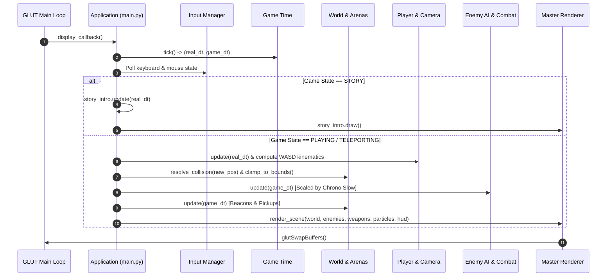

# Architecture & System Design

## 1. Project Overview

**Riftwalker: Paradox Protocol** is built using Python 3, PyOpenGL, and GLUT for the CSE423 Computer Graphics laboratory. The software architecture follows a modular, decoupled design with strict separation of concerns across 4 core modules (`M1` to `M4`), a shared foundation layer (`src/shared/`), an asset texture pipeline (`assets/textures/`), and a dedicated unit testing suite (`tests/`).

---

## 2. Complete Repository & File Structure

```text
CSE423_LAB_Project/
├── run_game.bat                          # ⚡ 1-Click Windows Launcher (auto-installs & launches)
├── run_game.ps1                          # ⚡ PowerShell Launcher
├── run_game.sh                           # ⚡ macOS / Linux Launcher
├── check_requirements.py                 # Dependency verification forwarder
├── requirements.txt                      # Python runtime dependencies
├── RUN_GUIDE.md                          # 📖 Step-by-step setup, Python installation & launch guide
├── README.md                             # Project documentation, controls, & workflow guide
├── PROJECT_SPEC.md                       # Comprehensive single source of truth specifications
├── AGENTS.md                             # Mandatory AI directives & Git branch protection rules
├── GEMINI.md                             # AI workspace directives
│
├── assets/                               # Static textures and visual assets
│   └── textures/
│       ├── background/                   # Space skybox & celestial backgrounds
│       │   └── space_background.png
│       ├── characters/                   # Character & enemy surface textures
│       │   ├── astronaut_suit.png
│       │   ├── astronaut_visor.png
│       │   ├── rift_guardian_core.png
│       │   ├── rift_spitter_body.png
│       │   └── rift_stalker_body.png
│       ├── environment/                  # Arena floor, wall, rock, & obstacle textures
│       │   ├── alien_structure.png
│       │   ├── astronaut_suit.png
│       │   ├── kepler_floor_panel.png
│       │   ├── kepler_metal_wall.png
│       │   ├── kepler_pipe_metal.png
│       │   ├── kepler_warning_panel.png
│       │   ├── sundered_crystal.png
│       │   └── sundered_rock.png
│       ├── rift/                         # Teleportation beacon runes & energy textures
│       │   ├── beacon_runes.png
│       │   └── rift_energy.png
│       └── weapons/                      # Plasma rifle & blaster textures
│           └── plasma_rifle.png
│
├── docs/                                 # Complete documentation & course guides
│   ├── PROJECT_BRIEF.md                  # High-level technical summary for instructors/evaluators
│   ├── Riftwalker-Paradox-protocol.md    # Course lab overview document
│   ├── architecture.md                   # Complete architectural specification & diagrams
│   ├── graphics_techniques.md            # Comprehensive graphics pipeline breakdown
│   ├── controls.md                       # Complete input bindings & control schemes
│   ├── team_tasks.md                     # Module ownership & feature delivery matrix
│   ├── implementation_notes.md           # Subsystem engineering notes
│   ├── integration_audit.md              # System integration audit
│   ├── TODO.md                           # Team task tracking
│   ├── CHANGELOG.md                      # Version release notes
│   └── specs/                            # Historical specification archives
│       └── Riftwalker_Paradox_Protocol_Project_Spec_v2.md
│
├── scripts/                              # Automated setup, installer & diagnostic scripts
│   ├── check_requirements.py             # Dependency validation & automatic pip installer
│   ├── setup_environment.py              # Setup runner wrapper
│   └── install_requirements.bat          # Windows batch installer with unit test run
│
├── scenes/                               # Scene layout definitions
│   ├── arena_01_kepler_relay/            # Arena 1 spawn & obstacle configurations
│   └── arena_02_sundered_rift/           # Arena 2 spawn & crystal layout configurations
│
├── screenshots/                          # Gameplay captures & evaluation screenshots
│
├── src/                                  # Application source code
│   ├── main.py                           # Master application entry point, GLUT setup & main loop
│   │
│   ├── shared/                           # Central shared utilities, math & collision
│   │   ├── __init__.py
│   │   ├── collision.py                  # Geometric tests, obstacles (Cylinder, Box), & sliding physics
│   │   ├── constants.py                  # Physics, gameplay, speed, camera, & key constants
│   │   ├── game_time.py                  # Delta time regulation & Chrono Slow time scaling
│   │   ├── input_manager.py              # Centralized keyboard, special key, & mouse state tracking
│   │   ├── math3d.py                     # Vector3, Matrix4, transformations, & ray intersection math
│   │   └── texture_loader.py             # Texture loading, caching, & procedural pattern generators
│   │
│   ├── M1_player_camera/                 # [M1] Player Character & View Systems
│   │   ├── __init__.py
│   │   ├── astronaut_rig.py              # Procedural hierarchical astronaut rig with walking limbs
│   │   ├── blink_teleport.py             # Short-range evasive combat dash
│   │   ├── first_person_camera.py        # 1st-person FPS camera with look-at transformations
│   │   ├── player.py                     # Player entity coordinator, health, & camera binding
│   │   ├── player_movement.py            # Kinematics, WASD movement, & velocity calculations
│   │   ├── player_weapon.py              # 1P weapon 3D viewmodel with recoil & muzzle flare
│   │   └── third_person_camera.py        # 3rd-person orbital follow camera
│   │
│   ├── M2_enemies_combat/                # [M2] Alien AI & Combat Systems
│   │   ├── __init__.py
│   │   ├── alien_generator.py            # Procedural crystalline void enemy geometry builder
│   │   ├── collision.py                  # Combat collision bridge & boundary helpers
│   │   ├── enemy_base.py                 # Abstract base enemy class with HP & draw transformations
│   │   ├── melee_rift_stalker.py         # Quadrupedal melee hunter AI with scythe blades
│   │   ├── ranged_rift_spitter.py        # Hovering plasma spitter AI with rotating shard rings
│   │   ├── raycast.py                    # Authoritative crosshair raycasting for hitscan lasers
│   │   ├── rift_guardian_boss.py         # Multi-phase boss with orbiting shield obelisks
│   │   └── weapon_system.py              # Enemy projectile manager, active projectiles & pool
│   │
│   ├── M3_world_teleport/                # [M3] Arenas, Environment & Teleportation
│   │   ├── __init__.py
│   │   ├── arena_01_kepler_relay.py      # Arena 1: Metallic space outpost with pillars & crates
│   │   ├── arena_02_sundered_rift.py     # Arena 2: Floating asteroid void with crystal spires
│   │   ├── arena_base.py                 # Abstract arena container with obstacle registry
│   │   ├── environment_generator.py      # Modular 3D props (crates, pillars, crystal spires)
│   │   ├── gravity_zone.py               # Predefined gravity & jump-pad zones
│   │   ├── rift_beacon.py                # Interactive teleportation beacon pillar with rotating rings
│   │   ├── rift_energy_pickup.py         # Collectible floating crystal restoring Chrono Charge
│   │   └── world.py                      # World manager coordinating active arenas & transitions
│   │
│   └── M4_rendering_gameplay/            # [M4] Graphics Pipeline, Effects, HUD & Game State
│       ├── __init__.py
│       ├── chrono_slow.py                # Chrono Slow manager (100% gate, 0% reset, 5s duration)
│       ├── crosshair.py                  # Interactive 2D crosshair with hitmarker animations
│       ├── effects.py                    # Post-processing screen flash & Chrono distortion tint
│       ├── game_state.py                 # Global state machine (STORY, PLAYING, TELEPORT, GAMEOVER, VICTORY)
│       ├── hud.py                        # 2D Orthographic HUD (Health, Chrono, Boss bar, Score)
│       ├── level_manager.py              # Wave progression & enemy spawn tables
│       ├── lighting.py                   # Multi-source lighting (GL_LIGHT0 sun, GL_LIGHT1 point lights)
│       ├── materials.py                  # Specular, diffuse, ambient, & texture binding materials
│       ├── particles.py                  # GPU-style particle emitter (vortex, sparks, bursts, ripples)
│       ├── primitives.py                 # Procedural textured primitives (cubes, cylinders, spheres, etc.)
│       ├── renderer.py                   # Master render orchestrator coordinating all passes
│       ├── scoring.py                    # Score evaluation, combo multipliers, & kill tracking
│       └── story_intro.py                # Terminal story intro with typewriter text & audio waveform
│
└── tests/                                # Automated Unit Test Suite
    ├── __init__.py
    ├── test_aiming_system.py             # Precision raycasting & muzzle alignment tests
    ├── test_camera_input.py              # Camera yaw/pitch clamping & view switching tests
    ├── test_collision.py                 # Sphere, AABB, cylinder sliding, & arena collision tests
    ├── test_gameplay_logic.py            # Scoring, state transitions, & chrono charge tests
    ├── test_math3d.py                    # Vector3 math, transformations, & ray tests
    ├── test_story_intro.py               # Story mode state machine & typing tests
    └── test_texture_loader.py            # Texture loading & procedural generator fallback tests
```

---

## 3. Subsystem Architecture

### 3.1 Foundation Layer (`src/shared/`)
* **`math3d.py`**: Immutable `Vector3` vector mathematics, matrix operations, clamping functions, and ray-geometry intersection algorithms (`ray_intersects_sphere`, `ray_intersects_aabb`).
* **`collision.py`**: Centralized collision engine. Defines `CylinderObstacle` and `BoxObstacle` spatial representations, horizontal circle-to-cylinder/AABB sliding push-out solvers (`resolve_circle_cylinder`, `resolve_circle_aabb`, `resolve_obstacles`), and arena boundary clamping.
* **`input_manager.py`**: Central keyboard, special key, and mouse state tracking with frame-based edge detection (`was_key_just_pressed`, `is_key_down`).
* **`game_time.py`**: Timekeeper providing real frame delta time (`real_dt`) and scaled simulation time (`game_dt = real_dt * 0.30` during Chrono Slow).
* **`texture_loader.py`**: Manages OpenGL 2D texture binding, file loading from `assets/textures/`, mipmapping (`gluBuild2DMipmaps`), and fallback procedural pixel generation.

### 3.2 Player & Camera Subsystem (`src/M1_player_camera/`)
* **`AstronautRig`**: Hierarchical OpenGL matrix model (`glPushMatrix`/`glPopMatrix`) rendering torso, chest plate, helmet visor, life support backpack, articulated arms with aim pitch, and animated walking legs.
* **`FirstPersonCamera` & `ThirdPersonCamera`**: Dual camera system sharing yaw/pitch state. 1P camera places the viewpoint at the astronaut's eye level; 3P camera orbits smoothly with configurable distance and height offsets.
* **`PlayerMovement` & `BlinkTeleport`**: Handles WASD kinematic translation, speed regulation, and evasive combat blink dashes with obstacle resolution.
* **`PlayerWeapon`**: Renders the first-person blaster rifle viewmodel with procedural idle bobbing, dynamic firing recoil, cyan plasma rail glow, and muzzle flare.

### 3.3 Enemy AI & Combat Subsystem (`src/M2_enemies_combat/`)
* **`AlienGenerator`**: Procedurally generates faceted obsidian Crystalline Void aliens with glowing rift cores and animated rotating shard rings.
* **`MeleeRiftStalker`**: Agile predator AI that hunts the player and delivers close-range scythe strikes.
* **`RangedRiftSpitter`**: Monolithic ranged AI that maintains distance (15–20 units) and fires plasma bolts.
* **`RiftGuardianBoss`**: Multi-phase boss entity featuring a pulsating nexus core and 4 orbiting shield obelisks. Transitions to Phase 2 at $\le 50\%$ HP with rapid rotation and radial shockwave bursts.
* **`RaycastSystem`**: Authoritative camera-eye raycasting for hitscan laser rifles with hit detection against enemy bounding volumes.

### 3.4 World & Teleportation Subsystem (`src/M3_world_teleport/`)
* **`ArenaKeplerRelay`**: Indoor/semi-outdoor metallic outpost with textured floor panels, perimeter security walls, cylindrical pillars, cargo crates, and collectible energy pickups.
* **`ArenaSunderedRift`**: Floating cosmic asteroid plateau with textured obsidian ground, neon anomaly boundaries, and towering crystal spires.
* **`RiftBeacon`**: Interactive teleportation platform featuring rotating cyan torus rings and proximity detection ($R \le 5.0$).
* **`RiftEnergyPickup`**: Floating, rotating crystal octahedrons providing +25% Chrono Charge restoration on collection (15s respawn cooldown).

### 3.5 Rendering & Gameplay Pipeline (`src/M4_rendering_gameplay/`)
* **`Renderer`**: Master orchestrator controlling multi-pass rendering:
  1. Camera projection & view matrix setup
  2. Dynamic lighting setup (`GL_LIGHT0` directional sun + `GL_LIGHT1` dynamic point lights)
  3. 3D textured world geometry & arena obstacles
  4. Enemy models & projectile meshes
  5. Player 3P astronaut rig or 1P weapon viewmodel
  6. Particle system simulation (vortex swirls, hit sparks, pickup bursts, death shatter)
  7. Post-processing screen flashes & Chrono Slow cool-blue overlay
  8. 2D orthographic HUD overlay (Suit health, Chrono bar, Boss bar, Score, Crosshair)
* **`StoryIntro`**: Narrative terminal sequence displaying typewriter lore, animated audio waveform visualizer, and prompt cues.
* **`ChronoSlow`**: Time-dilation manager enforcing a 100% combat charge gate, 5.0-second fixed duration, 30% simulation speed scaling, and automatic reset to 0%.

---

## 4. Frame Execution Lifecycle



---

## 5. Collision Architecture

```text
                     +---------------------------------------+
                     |        src/shared/collision.py        |
                     +---------------------------------------+
                     |  CollisionGeometry (Pure Geometric)   |
                     |  - resolve_circle_cylinder()          |
                     |  - resolve_circle_aabb()              |
                     |  - resolve_obstacles() (Multi-pass)   |
                     |  - clamp_to_arena_bounds()            |
                     |  - ray_intersects_sphere() / aabb()   |
                     +-------------------+-------------------+
                                         |
             +---------------------------+---------------------------+
             |                                                       |
+------------v------------+                             +------------v------------+
|   src/M3_world_teleport  |                             |   src/M1_player_camera  |
+-------------------------+                             +-------------------------+
| ArenaKeplerRelay        |                             | Player Movement (WASD)  |
| - 4x Cylinder Pillars   |                             | - Kinematic step        |
| - 4x AABB Cargo Crates  |                             | - Obstacle sliding      |
| - 1x Beacon Platform    |                             | - Bounds clamping       |
|                         |                             |                         |
| ArenaSunderedRift       |                             | Blink Combat Dash ('E') |
| - 5x Crystal Spires     |                             | - Obstacle sliding      |
| - 1x Beacon Platform    |                             | - Bounds clamping       |
+-------------------------+                             +-------------------------+
```

---

## 6. Texture Mapping Pipeline

1. **Asset Storage:** Textures are stored in `assets/textures/` as standard 24/32-bit PNG images.
2. **Texture Loader (`src/shared/texture_loader.py`):**
   - Automatically attempts to load and bind PNG files using PIL/Pillow or raw image parsers.
   - If an image file is unavailable, automatically generates high-contrast procedural pixel arrays (hex grids, metallic circuits, obsidian rock veins, rune circles).
   - Generates mipmaps using `gluBuild2DMipmaps(GL_TEXTURE_2D, ...)` with `GL_LINEAR_MIPMAP_LINEAR` filtering and `GL_REPEAT` wrapping.
3. **Material Binding (`src/M4_rendering_gameplay/materials.py`):**
   - Coordinates `glBindTexture(GL_TEXTURE_2D, tex_id)` with ambient, diffuse, and specular lighting parameters.
4. **UV Geometry Mapping (`src/M4_rendering_gameplay/primitives.py`):**
   - Explicit UV texture coordinates (`glTexCoord2f`) mapped across procedural cubes, cylinders, planes, spheres, and octahedrons.
